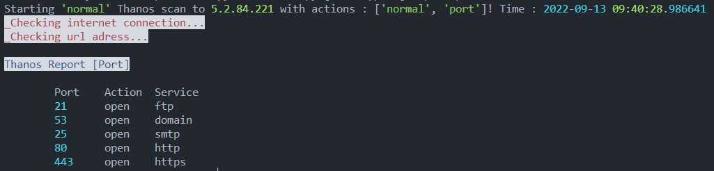

# Thanos 

[](https://github.com/thesaderror/thanos/issues)
[](https://github.com/thesaderror/thanos/stargazers)


**Thanos is python based website vulnerability scanner. You can use it to get report of vulnerabilities of your website.
Also if there is bug or error etc. thanos will report you with large explanation. Try learn to use it correctly. 
There is all options you need to scan deeply...**

## Install

- [x] **Debian [Kali,Parrot,Ubuntu,Mint,KDE]**

#### Option 1
```bash
sudo apt upgrade
git clone https://github.com/thesaderror/thanos
cd thanos
pip3 install -r requirements.txt
sudo pip3 install -r requirements.txt
sudo python3 thanos.py thanos
```
#### Option 2
```
curl  -s https://raw.githubusercontent.com/thesaderror/thanos/main/install_debian.sh | bash
```

## Usage
```
Thanos 1.3

-SCAN :
    -port : python3 thanos.py [normal,port]https://example.com
    |
    |__ Description : Port scanning -[Windows,Linux,Mac]
    
    -subdomain : python3 thanos.py [normal,sub]https://example.com
    |
    |__ Description : Find subdomains of website -[Windows,Linux,Mac]
    
    -directory : python3 thanos.py [normal,dir]https://example.com
    |
    |__ Description : Get all directories of website -[Windows,Linux,Mac]
    
    -record : python3 thanos.py [normal,record]https://example.com
    |
    |__ Description : Record website and extract hidden links -[Windows]

-SAVE :
    save output : python3 thanos.py [normal,port,dir,sub]example.com

Update : python3 thanos.py update
Full : python3 thanos.py [x]example.com
```

## Example

#### Port Scan
```bash
python3 thanos.py [normal,port]https://pakkan.com.tr
```


# Copright
#### (c) Thanos developed and created by Thesaderror.


